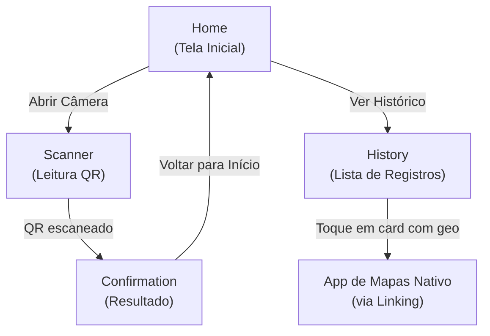
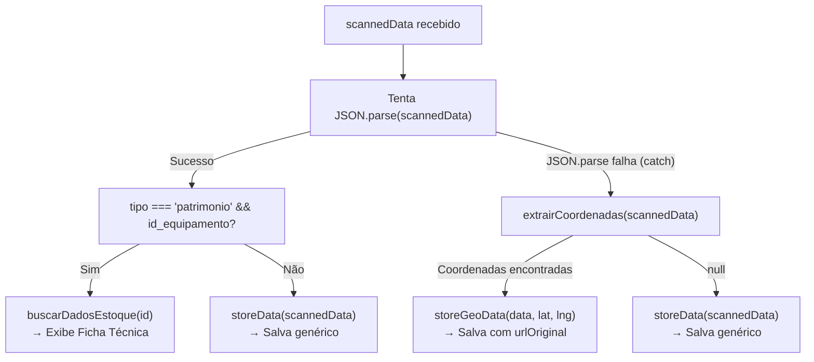
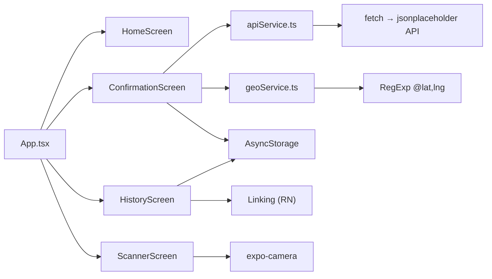

# 📋 Análise Completa do Projeto — `trab02-prog.mobile`

> **Data da análise:** 25/05/2026  
> **Total de arquivos de código-fonte:** 10 (excluindo `node_modules`, `package-lock.json` e assets binários)  
> **Linhas de código (soma das telas + serviços):** ~741 linhas

---

## 1. Visão Geral

O projeto é um **aplicativo mobile** desenvolvido em **React Native com Expo SDK 54**, escrito em **TypeScript**. Trata-se de um **leitor de QR Code** que, após a leitura, classifica o dado escaneado em 3 categorias distintas e executa fluxos diferentes para cada uma:

| # | Tipo de QR Code | Comportamento |
|---|---|---|
| 1 | **JSON de patrimônio** (`{ tipo: "patrimonio", id_equipamento: N }`) | Faz chamada a API externa para buscar ficha técnica do equipamento |
| 2 | **URL de geolocalização** (contendo `@lat,lng` no padrão Google Maps) | Extrai coordenadas via regex e salva localmente com link para mapa |
| 3 | **Texto genérico** (qualquer outro dado) | Salva localmente e apresenta 4 ações padrão |

---

## 2. Stack Tecnológica

| Camada | Tecnologia | Versão |
|---|---|---|
| **Framework** | Expo | `~54.0.33` |
| **UI** | React Native | `0.81.5` |
| **React** | React | `19.1.0` |
| **Linguagem** | TypeScript | `~5.9.2` |
| **Navegação** | React Navigation (Stack) | `^7.9.2` |
| **Câmera / Barcode** | expo-camera (`CameraView`) | `~17.0.10` |
| **Persistência** | AsyncStorage | `2.2.0` |
| **Gestos** | react-native-gesture-handler | `~2.28.0` |
| **Áreas seguras** | react-native-safe-area-context | `~5.6.0` |
| **Telas nativas** | react-native-screens | `~4.16.0` |
| **Web** | react-native-web | `^0.21.0` |

> [!NOTE]
> A New Architecture do React Native está habilitada (`"newArchEnabled": true` em [app.json](file:///c:/Users/Julio/OneDrive/Documentos/trab02-prog.mobile/app.json)).

---

## 3. Arquitetura de Diretórios

```
trab02-prog.mobile/
├── App.tsx                          # Raiz: NavigationContainer + Stack Navigator
├── index.ts                         # Entry point (registerRootComponent)
├── app.json                         # Configuração Expo
├── package.json                     # Dependências
├── tsconfig.json                    # TypeScript (strict, herda de expo)
├── AGENTS.md / CLAUDE.md            # Instruções para agentes IA
├── assets/
│   ├── adaptive-icon.png
│   ├── favicon.png
│   ├── icon.png
│   └── splash-icon.png
└── src/
    └── screens/
        ├── HomeScreen.tsx           # Tela inicial (45 linhas)
        ├── ScannerScreen.tsx        # Tela da câmera QR (77 linhas)
        ├── ConfirmationScreen.tsx   # Tela de resultado (273 linhas) ← mais complexa
        ├── HistoryScreen.tsx        # Tela de histórico (206 linhas)
        └── services/
            ├── apiService.ts        # Busca de equipamento via API (109 linhas)
            ├── geoService.ts        # Extração de coordenadas via regex (21 linhas)
            ├── cartService.ts       # VAZIO (0 bytes - placeholder)
            └── validationService.ts # VAZIO (0 bytes - placeholder)
```

---

## 4. Fluxo de Navegação

O app usa **Stack Navigator** com 4 rotas:



### Tipagem das Rotas — [App.tsx](file:///c:/Users/Julio/OneDrive/Documentos/trab02-prog.mobile/App.tsx)

```typescript
export type RootStackParamList = {
  Home: undefined;
  Scanner: undefined;
  History: undefined;
  Confirmation: { scannedData: string };
};
```

> Apenas a rota `Confirmation` recebe parâmetro (`scannedData`).

---

## 5. Detalhamento das Telas

### 5.1 [HomeScreen.tsx](file:///c:/Users/Julio/OneDrive/Documentos/trab02-prog.mobile/src/screens/HomeScreen.tsx) — Tela Inicial

| Aspecto | Detalhe |
|---|---|
| **Tamanho** | 45 linhas |
| **Complexidade** | Baixa — componente puramente presentacional |
| **Props** | `StackScreenProps<RootStackParamList, "Home">` |
| **Funcionalidade** | Dois botões: "Abrir Câmera para Escanear" (navega para `Scanner`) e "Ver Histórico de Registros" (navega para `History`) |
| **Estilização** | Background `#f5f5f5`, fonte bold 24px, botões com cores `#007bff` e `#28a745` |

---

### 5.2 [ScannerScreen.tsx](file:///c:/Users/Julio/OneDrive/Documentos/trab02-prog.mobile/src/screens/ScannerScreen.tsx) — Tela de Leitura QR

| Aspecto | Detalhe |
|---|---|
| **Tamanho** | 77 linhas |
| **Complexidade** | Média |
| **Props** | `StackScreenProps<RootStackParamList, "Scanner">` |
| **Permissão** | Solicita `Camera.requestCameraPermissionsAsync()` via `useEffect` |
| **Componente de câmera** | `CameraView` do `expo-camera` (API moderna do SDK 54) |
| **Tipo de barcode** | Apenas `["qr"]` |
| **Anti-duplo-scan** | Estado `scanned` impede múltiplas leituras; resetado via `useFocusEffect` ao retornar à tela |
| **Navegação** | Ao escanear, navega para `Confirmation` com `{ scannedData: data }` |
| **Estados de permissão** | 3 estados: `null` (solicitando), `false` (negado), `true` (câmera ativa) |

---

### 5.3 [ConfirmationScreen.tsx](file:///c:/Users/Julio/OneDrive/Documentos/trab02-prog.mobile/src/screens/ConfirmationScreen.tsx) — Tela de Resultado

> [!IMPORTANT]
> Esta é a **tela mais complexa** do projeto (273 linhas). Concentra toda a lógica de classificação do QR Code e os 3 fluxos de processamento.

| Aspecto | Detalhe |
|---|---|
| **Tamanho** | 273 linhas |
| **Complexidade** | Alta |
| **Props** | `StackScreenProps<RootStackParamList, "Confirmation">` |

#### Fluxo de Processamento (`useEffect` → `processarLeitura`)



#### Funções internas:

| Função | Descrição |
|---|---|
| `storeData(data)` | Salva registro genérico no AsyncStorage com `{ id, data, timestamp }` |
| `storeGeoData(data, lat, lng)` | Salva registro geo com `{ id, data: "Latitude/Longitude", urlOriginal: data, timestamp }` |

#### Renderização condicional (3 cenários):

1. **`equipamentoDados` existe** → Ficha técnica com título, patrimônio, descrição + botão "Conferir Equipamento"
2. **`isGeoLocation === true`** → Exibe coordenadas + mensagem informativa
3. **Caso padrão** → Dado bruto + 4 botões de ação genérica (ações 1-4)

---

### 5.4 [HistoryScreen.tsx](file:///c:/Users/Julio/OneDrive/Documentos/trab02-prog.mobile/src/screens/HistoryScreen.tsx) — Tela de Histórico

| Aspecto | Detalhe |
|---|---|
| **Tamanho** | 206 linhas |
| **Complexidade** | Média-alta |
| **Props** | `StackScreenProps<RootStackParamList, "History">` |
| **Carregamento** | `useFocusEffect` → `fetchRecords()` (recarrega ao focar na tela) |
| **Pull-to-refresh** | Sim, via `RefreshControl` |
| **Lista** | `FlatList<ScannedRecord>`, ordenada por `id` decrescente (mais recente primeiro) |
| **Interação no card** | `TouchableOpacity` → `abrirMapaCelular(item.urlOriginal)` via `Linking.openURL` |

#### Renderização diferenciada por card:

| Condição | Visual |
|---|---|
| `item.urlOriginal` presente | 🗺️ ícone verde + "Localização (Toque para abrir no Mapa)" |
| Sem `urlOriginal` | "Dados do QR Code:" em cinza + dado truncado (1 linha) |

---

## 6. Detalhamento dos Serviços

### 6.1 [apiService.ts](file:///c:/Users/Julio/OneDrive/Documentos/trab02-prog.mobile/src/screens/services/apiService.ts) — Serviço de API Externa

| Aspecto | Detalhe |
|---|---|
| **Tamanho** | 109 linhas (muito bem documentado com comentários didáticos) |
| **Interface exportada** | `Equipamento { id, title, body, patrimonio }` |
| **Função exportada** | `buscarDadosEstoque(idEquipamento: number): Promise<Equipamento \| null>` |
| **API utilizada** | `https://jsonplaceholder.typicode.com/posts/{id}` (API de teste) |
| **Mapeamento** | `dadosDaAPI.id` → `id`, `"Equipamento de TI #N"` → `title`, `dadosDaAPI.title` → `body`, `"BRM-2026-{N*7}"` → `patrimonio` |
| **Tratamento de erros** | try/catch, retorna `null` em caso de falha |

> [!NOTE]
> A API `jsonplaceholder.typicode.com` é uma **API pública fake** usada para fins de desenvolvimento/demonstração. Em produção, seria substituída pela API real do sistema de inventário.

---

### 6.2 [geoService.ts](file:///c:/Users/Julio/OneDrive/Documentos/trab02-prog.mobile/src/screens/services/geoService.ts) — Serviço de Geolocalização

| Aspecto | Detalhe |
|---|---|
| **Tamanho** | 21 linhas |
| **Interface exportada** | `Coordenadas { latitude: string, longitude: string }` |
| **Função exportada** | `extrairCoordenadas(url: string): Coordenadas \| null` |
| **Regex** | `/@(-?\d+\.\d+),(-?\d+\.\d+)/` — captura padrão `@lat,lng` de URLs do Google Maps |

---

### 6.3 [cartService.ts](file:///c:/Users/Julio/OneDrive/Documentos/trab02-prog.mobile/src/screens/services/cartService.ts) — Serviço de Carrinho

> [!WARNING]
> **Arquivo vazio** (0 bytes). Parece ser um placeholder para funcionalidade futura (talvez carrinho de compras ou carrinho de equipamentos).

---

### 6.4 [validationService.ts](file:///c:/Users/Julio/OneDrive/Documentos/trab02-prog.mobile/src/screens/services/validationService.ts) — Serviço de Validação

> [!WARNING]
> **Arquivo vazio** (0 bytes). Placeholder para lógica de validação futura.

---

## 7. Modelo de Dados (Persistência Local)

### Chave AsyncStorage: `@scanned_qrcodes`

Armazena um **array JSON** de `ScannedRecord`:

```typescript
interface ScannedRecord {
  id: number;          // Date.now() — timestamp como ID único
  data: string;        // Dado do QR Code ou "Latitude: X\nLongitude: Y"
  timestamp: string;   // ISO string (new Date().toISOString())
  urlOriginal?: string; // Presente SOMENTE em registros de geolocalização
}
```

> [!NOTE]
> O campo `urlOriginal` é o diferenciador chave: quando presente, o `HistoryScreen` renderiza o card como "Localização" com ícone de mapa e ação de abrir via `Linking`.

---

## 8. Permissões do App

| Plataforma | Permissão | Configuração |
|---|---|---|
| **Android** | `CAMERA` | Declarada em [app.json](file:///c:/Users/Julio/OneDrive/Documentos/trab02-prog.mobile/app.json) → `android.permissions` |
| **iOS** | Câmera | `NSCameraUsageDescription` em `ios.infoPlist` |
| **Runtime** | Câmera | Solicitada via `Camera.requestCameraPermissionsAsync()` no `ScannerScreen` |

---

## 9. Configurações do App

| Configuração | Valor |
|---|---|
| Nome | `trab2` |
| Slug | `trab2` |
| Versão | `1.0.0` |
| Orientação | Portrait (retrato) |
| UI Style | Light |
| New Architecture | ✅ Habilitada |
| Edge-to-Edge (Android) | ✅ Habilitado |
| Predictive Back (Android) | ❌ Desabilitado |
| TypeScript strict | ✅ Habilitado |

---

## 10. Observações e Pontos de Atenção

### ✅ Pontos Positivos
- **Tipagem forte** com TypeScript strict e tipagem explícita das rotas
- **Separação de serviços** em arquivos dedicados (`apiService`, `geoService`)
- **Documentação inline** excelente no `apiService.ts` (comentários didáticos)
- **Uso correto** do `useFocusEffect` para refresh de dados
- **Anti-duplicate scan** bem implementado no `ScannerScreen`
- **Pull-to-refresh** no histórico
- **Nova arquitetura** habilitada (bom para performance)

### ⚠️ Pontos de Atenção
1. **Arquivos vazios**: `cartService.ts` e `validationService.ts` estão vazios — código morto ou funcionalidade pendente
2. **Organização de pastas**: A pasta `services` está dentro de `screens`, mas serviços são transversais — por convenção ficaria melhor em `src/services/`
3. **Interface `ScannedRecord` duplicada**: Definida tanto em `ConfirmationScreen.tsx` (L26-31) quanto em `HistoryScreen.tsx` (L22-27) — deveria ser extraída para um arquivo compartilhado
4. **API mock**: O `apiService.ts` usa `jsonplaceholder.typicode.com` — precisa ser substituída em produção
5. **Sem estado global**: Todo estado é local a cada tela; se crescer, pode precisar de Context ou Zustand
6. **Sem tratamento de deep linking**: O app não tem configuração de deep links
7. **Import path inconsistente**: `ConfirmationScreen` importa de `"../screens/services/geoService"` — o caminho funciona mas é estranho (está dentro de screens importando `../screens/services/`)

### 📊 Métricas de Complexidade

| Arquivo | Linhas | Estados | Efeitos | Complexidade |
|---|---|---|---|---|
| `HomeScreen.tsx` | 45 | 0 | 0 | 🟢 Baixa |
| `ScannerScreen.tsx` | 77 | 2 | 2 | 🟡 Média |
| `HistoryScreen.tsx` | 206 | 3 | 2 | 🟡 Média |
| `ConfirmationScreen.tsx` | 273 | 4 | 1 | 🔴 Alta |
| `apiService.ts` | 109 | — | — | 🟡 Média |
| `geoService.ts` | 21 | — | — | 🟢 Baixa |

---

## 11. Dependências de Runtime (Grafo)



---

> **Resumo final:** O projeto é um app Expo/React Native de complexidade **média**, bem estruturado para um trabalho acadêmico, com boa tipagem e separação de responsabilidades. A tela `ConfirmationScreen` é o hub central da lógica de negócio. Os arquivos vazios (`cartService`, `validationService`) indicam funcionalidades planejadas mas ainda não implementadas.
